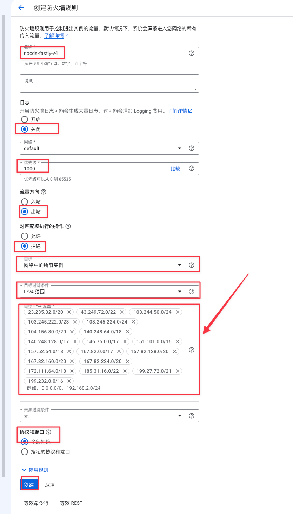
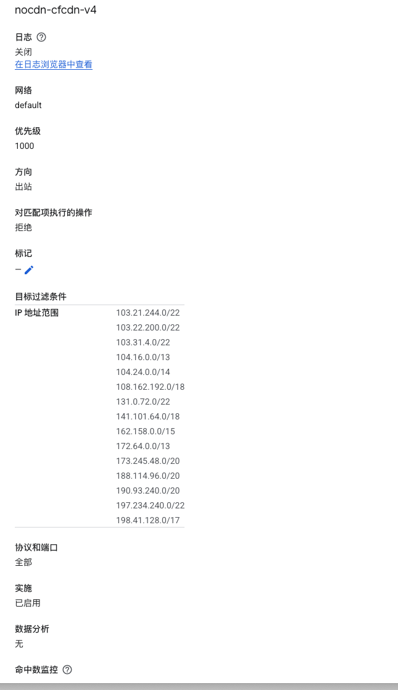
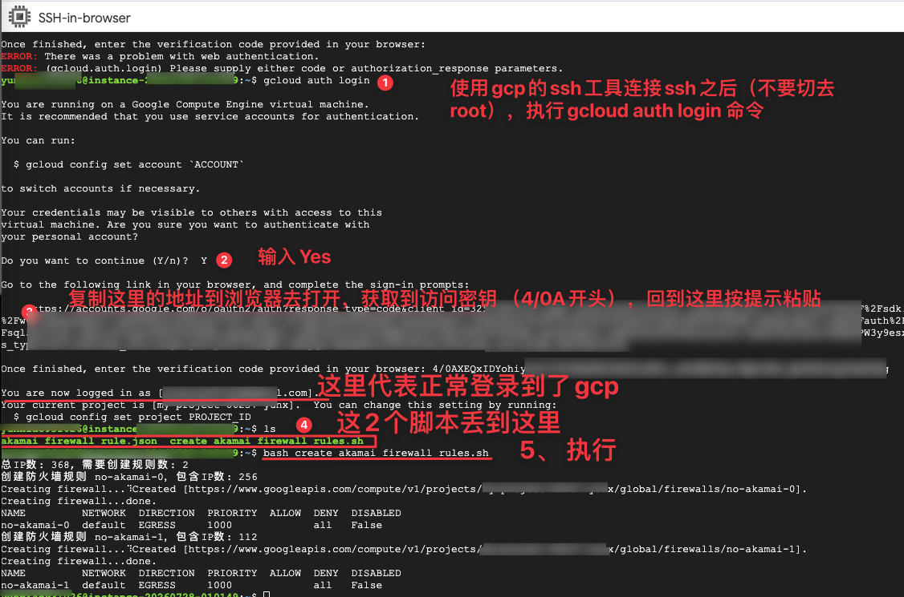
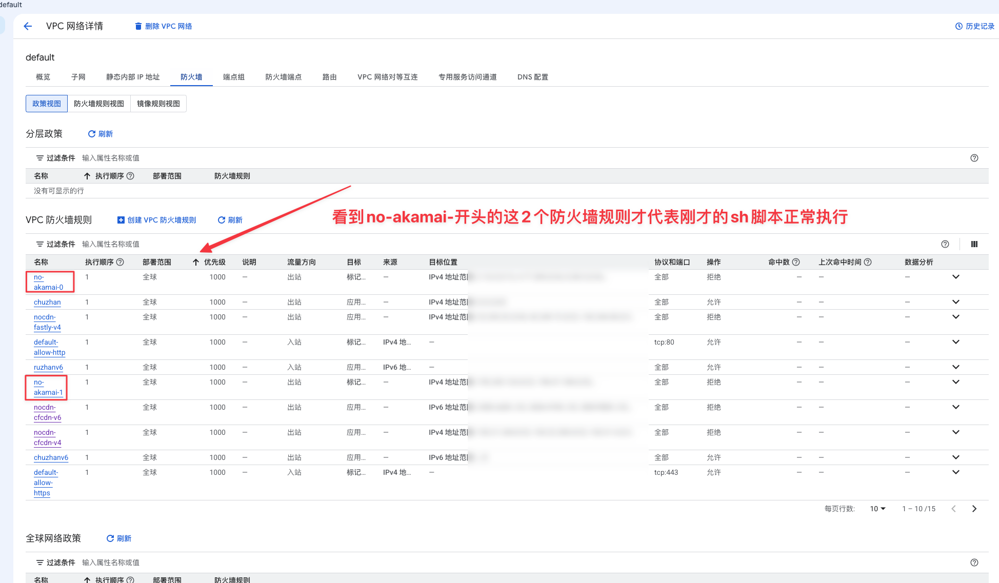
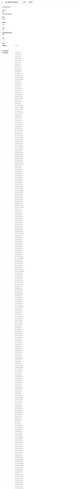
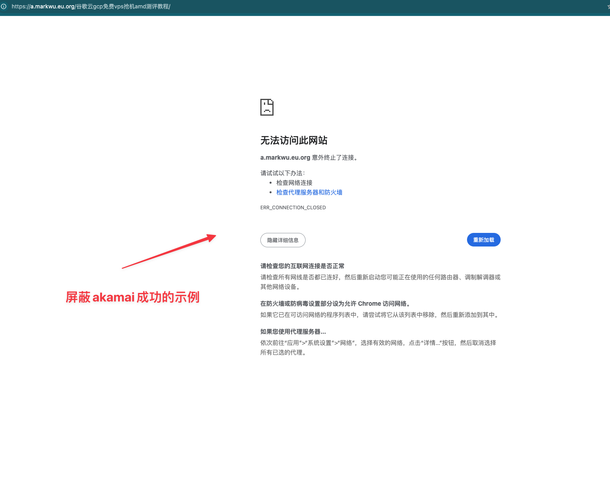

# GCP 防火墙屏蔽 CDN IP 避免产生流量扣费

通过配置 GCP 防火墙规则，阻止出站流量访问 CDN 服务商的 IP 地址，避免产生不必要的流量费用。

## 🎯 目标

防火墙禁用流量出站到以下三家 CDN 服务商：
- **Cloudflare**
- **Fastly**
- **Akamai**

---


## 📊 CDN 地址来源

| CDN 厂商 | 地址来源 |  ipv4来源 |  ipv6来源 |
|---------|---------|---------|---------|
| Cloudflare | [查看 CF 地址来源](https://www.cloudflare.com/zh-cn/ips/) | [查看 CF ipv4来源](https://www.cloudflare.com/ips-v4/#) | [查看 CF ipv6来源](https://www.cloudflare.com/ips-v6/#) |
| Fastly | [查看 Fastly 地址来源](https://api.fastly.com/public-ip-list) |[查看 Fastly ipv4来源](https://api.fastly.com/public-ip-list) |[查看 Fastly ipv6来源](https://api.fastly.com/public-ip-list) |
| Akamai | [查看 Akamai 地址来源](https://github.com/SecOps-Institute/Akamai-ASN-and-IPs-List/blob/master/akamai_ip_list.lst) |[查看 Akamai 整合版IP来源](https://a.markwu.eu.org/wp-content/uploads/2025/07/%E6%95%B4%E7%90%86%E7%89%88akamai_ip_cleaned.txt) |[查看 Akamai 整合版IP json来源](https://a.markwu.eu.org/wp-content/uploads/2025/07/akamai_firewall_rule.json) |

> **说明：** CF 和 Fastly 的 IP 数量较少，可手动添加到防火墙规则。Akamai IP 段较多，建议使用脚本批量导入(参见 create_akamai_firewall_rules.sh)。


## ⚙️ 防火墙规则设置

```
方向：出站
动作：拒绝
目标：网络中所有实例（或带标签的实例）
范围：CDN IP 段
协议：全部协议和端口
动作：全部拒绝
```
详细ip导入图示如下（以fastly ip作为示例）：
<p align="center">
  
</p>

下面是cloudflare ip的示例：
<p align="center">
  
</p>


---

## 📁 IP 列表文件

| 文件 | 说明 |
|-----|------|
| `1-cfcdn-ip.txt` | Cloudflare IP 列表 |
| `2-fastly-ip.txt` | Fastly IP 列表 |

请分别将上述 txt 文件中的 IP 导入到防火墙规则中。

---

## 🚀 GCP Cloud Shell 导入拦截 Akamai IP 规则
### 脚本功能

- 从 `akamai_firewall_rule.json` 读取 IP 列表
- 分批（每批最多 256 个 IP）批量创建 GCP 出站防火墙规则

### 第一步：查看 GCP VM 实例

```bash
gcloud compute instances list
```

### 第二步：运行脚本

脚本文件：[create_akamai_firewall_rules.sh](create_akamai_firewall_rules.sh)

只需要改IP_FILE 这个参数的路径值(akamai_firewall_rule.json 这个文件你自己上传到指定地方哦)，其他参数值我都给你改好了。
```bash
#!/bin/bash

# 【必须需改1】：IP 文件路径（你的google账号名,这个文件夹自己本来就有）
IP_FILE="/home/你的google账号名/akamai_firewall_rule.json"

# 【可改2】：规则名称前缀(我给你改好了)
RULE_PREFIX="no-akamai"

# 【一般不改】：网络名称（GCP 默认是 default）
NETWORK="default"

# 【一般不改】：出站规则
DIRECTION="EGRESS"

# 【可改3】：优先级（0～65535，数字越小优先级越高）
PRIORITY=1000

# 【需改4】：目标实例标签
TARGET_TAGS="no-akamai-acc"

# 【一般不改】：动作设为 deny 表示阻止流量
ACTION="deny"

# 【可改5】：协议类型，"all" 表示所有协议
PROTOCOL="all"

# 读取 IP 列表到数组
mapfile -t IPS < "$IP_FILE"

# 每条防火墙规则最多允许 256 个 IP
MAX_IP=256
TOTAL_IP=${#IPS[@]}
NUM_RULES=$(( (TOTAL_IP + MAX_IP - 1) / MAX_IP ))

echo "总IP数: $TOTAL_IP, 需要创建规则数: $NUM_RULES"

# 分批创建防火墙规则
for ((i=0; i<NUM_RULES; i++)); do
    start=$((i * MAX_IP))
    end=$((start + MAX_IP))
    if [ $end -gt $TOTAL_IP ]; then
        end=$TOTAL_IP
    fi

    IP_SUBLIST=$(printf ",%s" "${IPS[@]:$start:$((end - start))}")
    IP_SUBLIST=${IP_SUBLIST:1}

    RULE_NAME="${RULE_PREFIX}-${i}"

    echo "创建防火墙规则 $RULE_NAME，包含IP数: $((end - start))"

    gcloud compute firewall-rules create "$RULE_NAME" \
      --network "$NETWORK" \
      --direction "$DIRECTION" \
      --priority "$PRIORITY" \
      --target-tags "$TARGET_TAGS" \
      --action "$ACTION" \
      --rules "$PROTOCOL" \
      --destination-ranges "$IP_SUBLIST"
done
```


<p align="center">
  
</p>

<p align="center">
  
</p>

<p align="center">
  
</p>

---

## ✅ 验证规则是否生效

完成配置后，尝试访问使用这三家 CDN 的网站，如果无法正常访问则表示屏蔽成功。 比如akamai可以直接访问下面的地址来确认屏蔽成功(它用了akamai的cdn)，没屏蔽ip的话，这个地址正常应该是可以打开的，
- https://a.markwu.eu.org/谷歌云gcp免费vps抢机amd测评教程/


以下为akamai cdn屏蔽成功的示例图：

<p align="center">
  
</p>
---


## 📖 参考来源

- https://www.nodeseek.com/post-393299-1
- https://a.markwu.eu.org/谷歌云gcp免费vps抢机amd测评教程/

------
# 下面这堆是给我自己参考用的（你们可以不用看）

## 🏷️ 给 VM 实例添加标签

如果在创建 VM 实例时忘记添加标签，可运行：

```bash
gcloud compute instances add-tags INSTANCE_NAME \
    --tags=no-cdn \
    --zone=ZONE_NAME \
    --project=PROJECT_ID
```

**替换说明：**
- `INSTANCE_NAME`：实例名称（如 `GCP`）
- `ZONE_NAME`：区域（如 `us-west1-c`）
- `PROJECT_ID`：项目 ID

---

## 🔍 查看现有标签

```bash
gcloud compute instances describe 实例名 --zone=区域 --project=项目ID --format="get(tags.items)"
```

输出为 `[]` 表示尚未添加标签。

---
